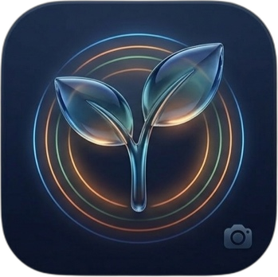
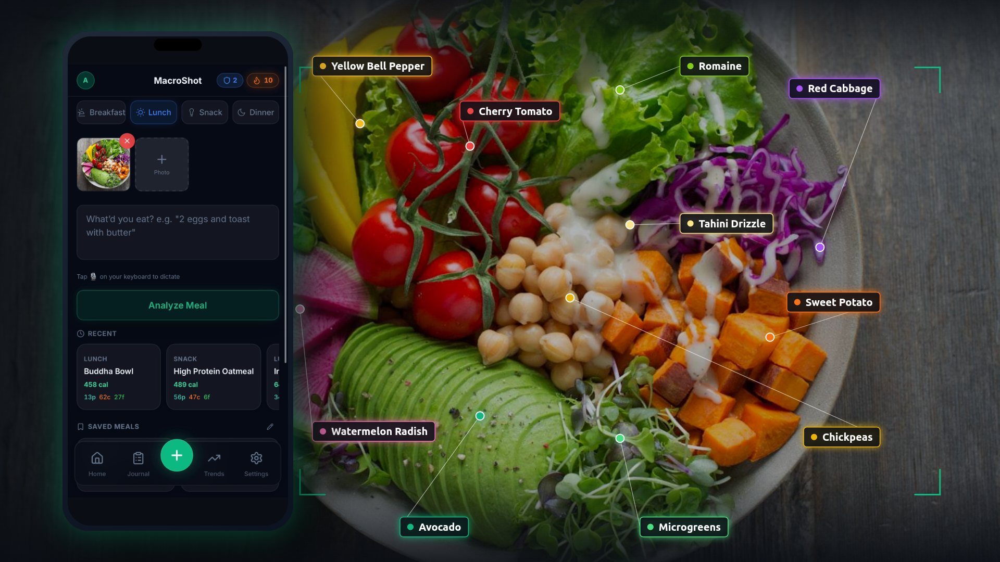
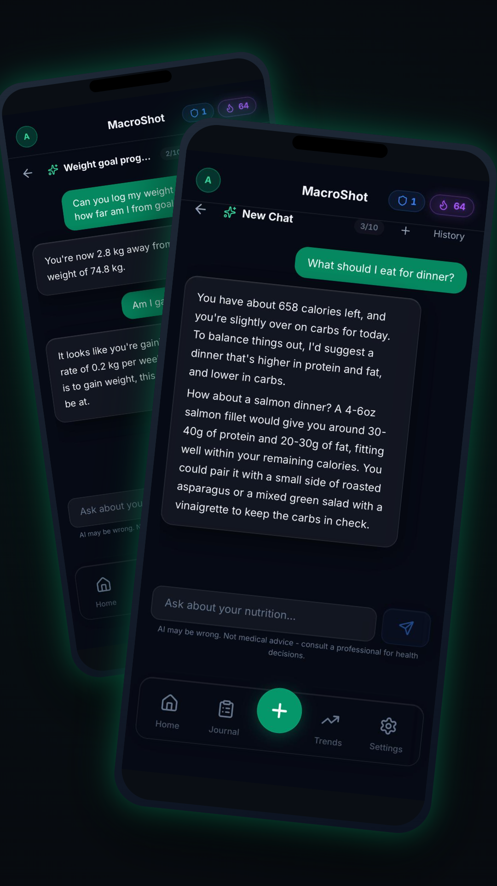
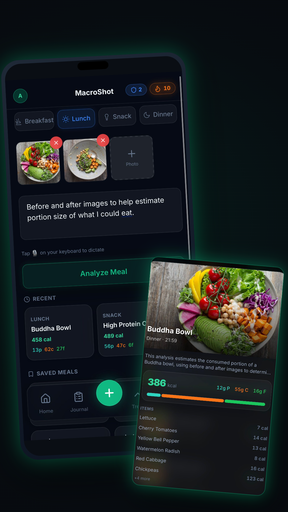
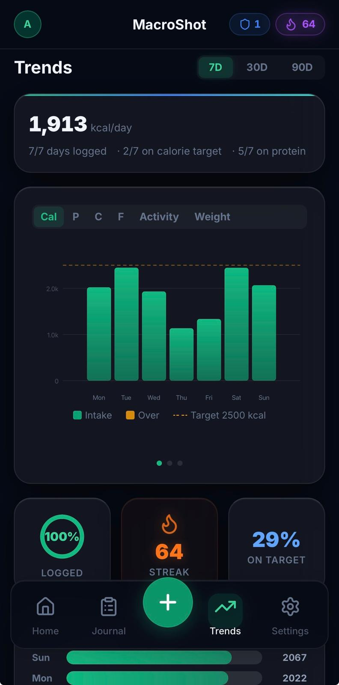
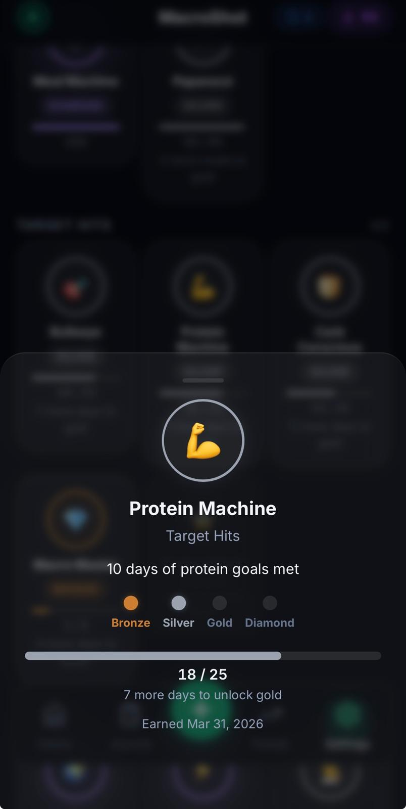

<p align="center">
  
</p>

<h1 align="center">MacroShot</h1>

<p align="center">
  <a href="https://github.com/anirudhtopiwala/macroshot/actions/workflows/ci.yml"></a>
  <a href="LICENSE"></a>
  
  
  <a href="https://github.com/sponsors/anirudhtopiwala"></a>
</p>

<p align="center">
  <em>Snap a photo. Know your macros. Own your data.</em>
</p>

<p align="center">
  The open-source AI macro tracker. Log meals by photo, text, or barcode.<br/>
  Chat with a nutrition coach that actually reads your data.<br/>
  Runs on every device you own - phone, tablet, laptop.
</p>

<p align="center">
  
</p>

<p align="center">
  <a href="https://macro.anirudhtopiwala.com/macro_app/"><strong>▶︎ Try the hosted version</strong></a>
  &nbsp;·&nbsp;
  <a href="#self-hosting">Self-host</a>
  &nbsp;·&nbsp;
  <a href="#screenshots">Screenshots</a>
</p>

---

## What it does

| | |
|---|---|
| 📸 **Log any way you want** | Snap a photo, type a sentence, or scan a barcode. AI handles portions. |
| ✨ **AI Coach** | MCP-powered chat with 23 tools for meals, targets, weight, workouts, and long-term memory (allergies, restrictions, preferences). |
| 📈 **Trends & Analytics** | 7/30/90-day charts for calories, macros, weight, and adherence. |
| 🏃 **Strava + Fitbit + Oura** | Auto-sync workouts; targets adjust based on what you burned. |
| ⚖️ **Weight Tracking** | Trend line shows progress against your goal, not just today's number. |
| ⭐ **Saved Meals** | One-tap quick-log for your regulars. No re-typing. |
| 🏆 **Streaks & Achievements** | 24 badges, Bronze→Diamond. Streak shields recover missed days. |
| 📔 **Journal + Gallery** | Browse meals as a list or photo wall. Search, filter, swipe-to-delete. |
| 📤 **Export & Share** | CSV download or PDF nutrition report for your doctor or coach. |
| 🖥️ **Every device** | Same PWA on phone, tablet, laptop. Installable, offline-ready, push reminders. |

## Screenshots

<table>
  <tr>
    <td align="center" width="50%">
      
      <br/><sub><b>AI coach reads your real data via MCP</b></sub>
    </td>
    <td align="center" width="50%">
      
      <br/><sub><b>Multi-photo meals - analyze each plate together</b></sub>
    </td>
  </tr>
  <tr>
    <td align="center" width="50%">
      
      <br/><sub><b>7/30/90-day trends with target reference lines</b></sub>
    </td>
    <td align="center" width="50%">
      
      <br/><sub><b>24 badges, Bronze to Diamond, with streak shields</b></sub>
    </td>
  </tr>
</table>

## Why MacroShot?

Three things make MacroShot different:

- **Log meals the way you actually eat.** Snap a photo of your plate, type "two scrambled eggs and a banana," or scan the barcode on a protein bar. The AI handles portions and macros - no more giving up on tracking because typing every meal is exhausting.
- **A coach that actually reads your data.** Not a chatbot that gives generic advice - an AI coach with structured access (via [MCP](https://modelcontextprotocol.io)) to your meals, targets, weight history, and connected workouts (Strava / Fitbit / Oura). Ask "did I hit protein this week?" and it answers from your real numbers.
- **Open source. Your data, your call.** Use the hosted version for zero-setup convenience, or self-host for total control. Either way the code is open and the data model is yours to inspect.

## Self-Hosting

> **Scope — personal or trusted-circle only.** MacroShot is built for
> personal use or a small trusted group (you, family, friends). Any
> email address can sign up and use the app once your instance is
> reachable. There is no per-user admin role beyond an `ADMIN_EMAIL`
> allowlist for the read-only metrics dashboard, no per-user quotas
> beyond the global free/Pro caps, and no tenant isolation beyond
> per-`user_id` row scoping. If you intend to run a public instance,
> put auth or IP allowlisting at the reverse proxy in front of it and
> read [`docs/self-hosting-legal.md`](docs/self-hosting-legal.md)
> first.

### Prerequisites

- Python 3.10+
- Node.js 18+ and npm
- A [Google Gemini API key](https://ai.google.dev/)
- (Optional) A [Google OAuth client](https://console.cloud.google.com/apis/credentials) for Google sign-in
- (Optional) A Stripe account for paid subscriptions
- (Optional) VAPID keys for push notifications (`npx web-push generate-vapid-keys`)

### Quick Start

```bash
git clone https://github.com/anirudhtopiwala/macroshot.git
cd macroshot
python3 -m venv .venv
.venv/bin/pip install -r requirements.txt
cp .env.example .env
chmod 600 .env         # restrict so other users on the box can't read your keys
$EDITOR .env           # fill in your keys (see Environment variables below)
cd web && npm install && npm run build && cd ..
.venv/bin/uvicorn src.web.app:app --host 127.0.0.1 --port 8000
```

> **Why `127.0.0.1`?** Binding to localhost keeps the dev server off
> your LAN and public IP. For production, use the systemd unit + reverse
> proxy in [docs/deploy.md](docs/deploy.md). To test on a phone over
> LAN, swap in `--host 0.0.0.0` **only** on a trusted network.

> **Production note:** before exposing the instance to anyone else,
> set `JWT_SECRET` to a strong random value (`openssl rand -hex 32`),
> set `APP_ENV=production`, set `OAUTH_TOKEN_KEY` if you enable any
> OAuth integrations, and put a TLS reverse proxy in front of uvicorn.
> See [SECURITY.md](SECURITY.md) for the full self-host hardening list.

The app will be available at `http://localhost:8000/macro_app/`.

> **Signing in locally:** the bundled `.env.example` sets `DEBUG_SHOW_PINS=1`,
> so when you sign up with an email address the 6-digit login PIN is printed
> to the uvicorn server log (the terminal where you ran the last command above)
> instead of being emailed. No Resend account needed to try the app. **Remove
> `DEBUG_SHOW_PINS` and configure `RESEND_API_KEY` + `RESEND_FROM_EMAIL`
> before exposing the instance to anyone else.**

For a production deployment with systemd + reverse proxy, see [docs/deploy.md](docs/deploy.md).

### Environment variables

The only required ones are:

| Variable | Description |
|---|---|
| `GEMINI_API_KEY` | Google Gemini API key for meal analysis |
| `JWT_SECRET` | Secret key for signing auth tokens (`openssl rand -hex 32`) |

> ⚠️ **Auth-bypass risk if `JWT_SECRET` is unset.** The app falls back
> to a hard-coded dev key (`dev-secret-change-in-production`). Anyone
> who knows this string can mint valid session tokens for your
> instance. Generate a real value with `openssl rand -hex 32` and set
> `APP_ENV=production` so the server refuses to boot with the dev key.

Everything else (Google OAuth, Stripe, push notifications, Strava / Fitbit / Oura, Sentry, instance branding strings) is optional and documented inline in [`.env.example`](.env.example). When `STRIPE_SECRET_KEY` is unset, the app runs in self-host mode - all features free, no billing gates.

### Self-hosting legal responsibilities

If you operate a public instance (even for friends or family), you become the **data controller** under GDPR / CCPA / MHMDA / similar privacy laws, and you take on real responsibilities - replace the bundled Privacy Policy + ToS to name yourself as the data controller, age-gate per your jurisdiction, post AI-disclaimers, and more.

> ⚖️ **Read [`docs/self-hosting-legal.md`](docs/self-hosting-legal.md) before exposing your instance to anyone other than yourself.** The bundled Privacy Policy + Terms apply only to the official hosted instance - you must publish your own.

## Tech Stack

| Layer | Technology |
|---|---|
| Frontend | React 19, Vite 7, TypeScript, Tailwind CSS, Workbox (PWA) |
| Backend | Python 3.10+, FastAPI, Uvicorn, Pydantic v2 |
| Database | SQLite via aiosqlite (with connection pooling) |
| AI | Gemini 2.5 Flash Lite (google-genai SDK), FastMCP for tool use |
| Auth | Google OAuth 2.0, email PIN (Resend), JWT sessions |
| Payments | Stripe (checkout, portal, webhooks) |
| Fitness | Strava API, Fitbit Web API (OAuth + PKCE) |
| Push | Web Push API via pywebpush (VAPID) |
| Hosting | Any Linux server (1 vCPU / 1 GB RAM is enough) |

## Contributing

See [CONTRIBUTING.md](CONTRIBUTING.md) for the full contributor guide. The short version:

1. Open an issue first to discuss what you'd like to change.
2. Fork the repo, create a feature branch.
3. Run the tests: `pytest tests/ -x -q` and `cd web && npx tsc -b --noEmit && npx vite build`.
4. Open a PR with a brief description and test plan.

By contributing, you agree to abide by the [Code of Conduct](CODE_OF_CONDUCT.md).

## Support the project

MacroShot is free to self-host. If it's useful to you and you'd like to support continued development:

- [GitHub Sponsors](https://github.com/sponsors/anirudhtopiwala) - one-time or recurring, no platform fees
- [Buy me a coffee](https://buy.stripe.com/5kQ3cu7rR9KI0Y34hN2go00) - one-time tip via Stripe

Sponsorship funds active development - new features, bug fixes, and time spent building in the open. Not tax-deductible.

## Contact & Security

Questions or feedback? Email **macroshotapp@gmail.com**.

For security issues, please use GitHub's **Private Vulnerability Reporting** (Security tab → Report a vulnerability) - see [SECURITY.md](SECURITY.md).

## License

[FSL-1.1-Apache-2.0](LICENSE) - Functional Source License, converting to Apache 2.0 after 2 years.

## Citation

```bibtex
@software{topiwala2026macroshot,
  author = {Topiwala, Anirudh},
  title  = {MacroShot: AI-Powered Meal Macro Tracker},
  year   = {2026},
  url    = {https://github.com/anirudhtopiwala/macroshot}
}
```
